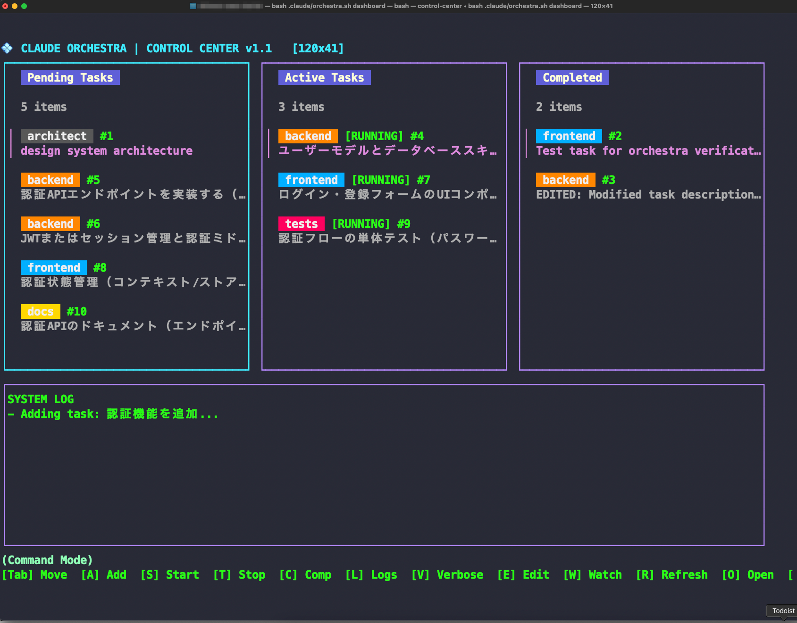
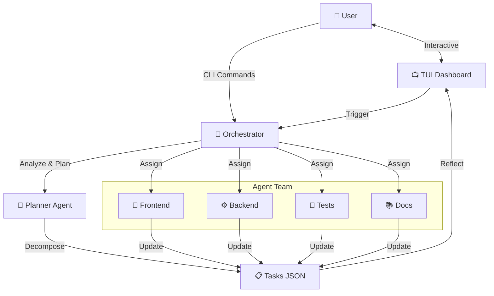

# Claude Orchestra 🎺

<div align="center">


**Self-Organizing Multi-Agent Development Infrastructure powered by Claude Code**

[Features](#-features) • [Installation](#-installation) • [Usage](#-usage) • [Architecture](#-architecture)

[日本語版はこちら](README.md)

</div>

---

## 🚀 Quick Start

**Summon an AI development team to your project with a single command.**

```bash
curl -fsSL https://raw.githubusercontent.com/shineos/claude-orchestra/main/install-remote.sh | bash
```

<br>



## 📖 Overview

**Claude Orchestra** extends Anthropic's official CLI tool `Claude Code` to create an orchestration system where multiple specialized agents collaborate on development tasks.

It's not just a chatbot. **From requirements definition to implementation, testing, and documentation**, AI agents autonomously divide and execute tasks, providing powerful support for your development workflow.

### Why Claude Orchestra?

- **⚡️ Parallel Development**: Frontend, Backend, Tests, and Docs agents work simultaneously, reducing development time.
- **🧠 Intelligent Task Decomposition**: AI analyzes complex requirements and automatically breaks them down into optimal subtasks.
- **🖥 Beautiful TUI**: An intuitive and beautiful dashboard that runs entirely in your terminal.

## ✨ Features

- **🤖 Autonomous Agent Team**
    - **Planner**: Overall planning and task management
    - **Frontend**: UI/UX implementation (React, Vue, Tailwind...)
    - **Backend**: API, DB design, server-side logic
    - **Tests**: Unit tests, integration tests creation and execution
    - **Docs**: README, specification auto-updates

- **📊 TUI Dashboard**
    - Real-time progress visualization
    - Kanban-style task management
    - Keyboard-optimized (Vim-like bindings)

- **🔄 Seamless Workflow**
    - Just `orch add "add feature"` and AI creates and proposes a plan
    - Approve and agents start working immediately
    - Logs can be streamed in real-time

## 📦 Installation

### Requirements
- macOS or Linux
- `bash` (4.0+ recommended)
- `jq`
- `claude` (Claude Code CLI)

### One-liner (Recommended)

```bash
# Install to the current directory's project
curl -fsSL https://raw.githubusercontent.com/shineos/claude-orchestra/main/install-remote.sh | bash
```

### Options

```bash
# Specify installation target
curl -fsSL https://raw.githubusercontent.com/shineos/claude-orchestra/main/install-remote.sh | bash -s -- /path/to/project

# Specify a specific version
curl -fsSL https://raw.githubusercontent.com/shineos/claude-orchestra/main/install-remote.sh | bash -s -- -v v1.0.0
```

### Recommended Aliases

```bash
# Add to .zshrc or .bashrc
alias orch='bash .claude/orchestra.sh'
alias agent='bash .claude/agent.sh'
```

## 🏗 Architecture



## 🎮 Usage

### 1. Add Task (AI Auto Mode)

Just describe what you want in natural language.

```bash
orch add "Implement user login functionality"
```

AI analyzes the task and creates a proposal. Approve with `Y` and agents start working.

### 2. Check Progress

Monitor all agents from the dashboard.

```bash
orch dashboard --watch
```

### 3. View Agent Logs

See what a specific agent is doing:

```bash
# Stream all agent logs
orch logs -f

# Specific agent only
orch logs -f backend
```

## 🛠 Command Reference

| Command | Description |
|---|---|
| `orch add "task"` | AI-powered task decomposition and addition |
| `orch status` | View task list and status |
| `orch dashboard` | Launch TUI dashboard |
| `orch logs` | View agent logs |
| `orch stop all` | Stop all agents |
| `orch clean` | Archive completed tasks |

For detailed documentation, see [docs/specification.md](docs/specification.md).

---

<div align="center">

**Enjoy Orchestration! 🎻**

[Report Bug](https://github.com/shineos/claude-orchestra/issues) • [Request Feature](https://github.com/shineos/claude-orchestra/issues)

</div>
