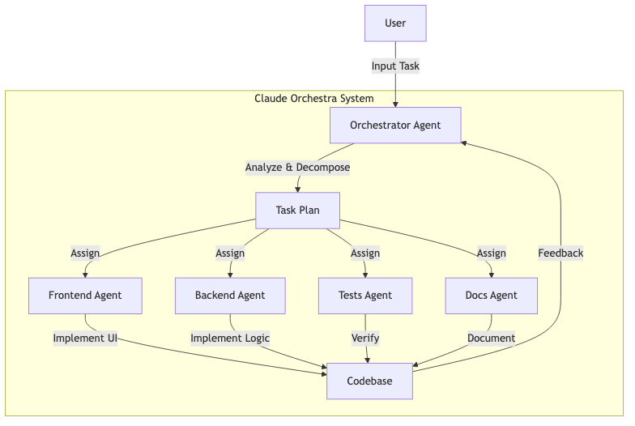
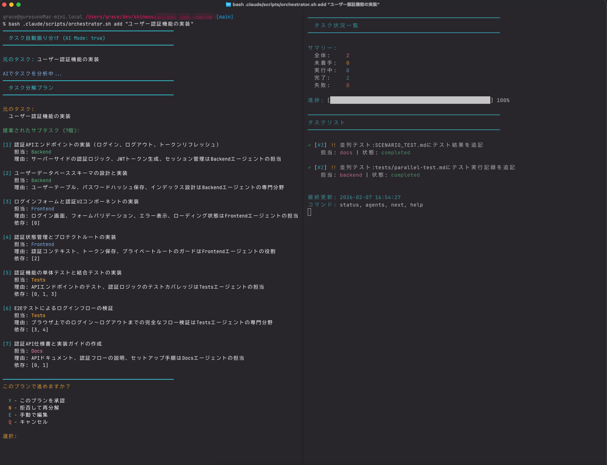

# Claude Code マルチエージェントシステム

Claude Code を活用したマルチエージェントシステム。Orchestrator（調整）と各専門エージェント（Frontend、Backend、Tests、Docs）が連携して効率的な開発を実現します。



## 前提条件

本システムを使用する前に、以下のツールがインストールされている必要があります。

### 必須

- **Claude Code CLI**: Anthropic の公式 Claude CLI ツール
  ```bash
  # インストール確認
  claude --version
  ```
  Claude Code がインストールされていない場合、AIタスク分解機能は動作しません。

- **jq**: JSON処理コマンドラインツール
  ```bash
  # macOS
  brew install jq

  # Ubuntu/Debian
  sudo apt install jq

  # インストール確認
  jq --version
  ```

- **bash**: シェルスクリプト実行環境
  ```bash
  # バージョン確認
  bash --version
  ```
  macOS のデフォルト `sh` では動作しません。必ず `bash` を使用してください。

### 推奨

- **tmux**: 複数エージェントの並列実行・監視を容易にするターミナルマルチプレクサ
  ```bash
  # macOS
  brew install tmux

  # Ubuntu/Debian
  sudo apt install tmux
  ```

## 特徴

- 🚀 **コピーするだけ** - `.claude-template` をプロジェクトにコピーするだけ
- 🤖 **AIタスク分解** - Claude AI がタスクを自動分解し、適切なエージェントを割り当て
- ✂️ **ユーザー確認フロー** - 分解結果を確認して承認・修正可能
- 📺 **リアルタイムモニタリング** - 各エージェントの作業状態を監視
- 🔄 **並列実行対応** - 複数エージェントを同時稼働

詳細な仕様については [docs/specification.md](docs/specification.md) を参照してください。


*使用例*

## インストール

### ワンライナーでインストール（推奨）

```bash
curl -fsSL https://raw.githubusercontent.com/shineos/claude-orchestra/main/install-remote.sh | bash
```

インストール先を指定する場合:
```bash
curl -fsSL https://raw.githubusercontent.com/shineos/claude-orchestra/main/install-remote.sh | bash -s -- /path/to/your-project
```

特定のバージョンをインストールする場合:
```bash
curl -fsSL https://raw.githubusercontent.com/shineos/claude-orchestra/main/install-remote.sh | bash -s -- -v v1.0.0
```

### GitHub Releases からインストール

1. [Releases](https://github.com/shineos/claude-orchestra/releases) ページから最新の `claude-orchestra.tar.gz` をダウンロード
2. 解凍してインストーラーを実行:

```bash
tar -xzf claude-orchestra.tar.gz
cd claude-orchestra
./install.sh /path/to/your-project
```

### ソースコードからインストール

```bash
# インストーラーを実行
cd /path/to/claude-orchestra
./install.sh /path/to/your-project

# ターゲットプロジェクトに移動
cd /path/to/your-project
```

### ⚠️ bash で実行してください

macOS の `sh` では動作しません。必ず `bash` を使用してください。

```bash
# ✗ 正しくない
sh .claude/scripts/orchestrator.sh status

# ✓ 正しい
bash .claude/scripts/orchestrator.sh status
```

### エイリアス設定（推奨）

`.zshrc` または `.bashrc` に追加：

```bash
alias orch="bash ./.claude/scripts/orchestrator.sh"
alias agent="bash ./.claude/agent.sh"

# AI を無効化してルールベースのみを使用する場合
# export USE_AI=false
```

---

## コマンド一覧

### タスク管理

| コマンド | 説明 |
|---------|------|
| `orch add "タスク説明"` | タスク追加（自動振り分け） |
| `orch add "タスク" <agent> <priority> [deps]` | タスク追加（手動指定） |
| `orch status` | タスク状況一覧 |
| `orch start <id>` | タスク開始 |
| `orch complete <id>` | タスク完了 |
| `orch fail <id> "理由"` | タスク失敗 |
| `orch next` | 次に実行可能なタスク表示 |

### エージェント操作

| コマンド | 説明 |
|---------|------|
| `agent <name>` | エージェント起動 |
| `orch launch` | 未着手タスクのエージェントを一括起動 |
| `orch agents` | エージェント別ステータス表示 |
| `orch monitor` | リアルタイムモニタリング（5秒更新） |
| `orch monitor-agents` | エージェント別リアルタイム監視 |
| `orch list` / `orch ps` | 実行中のエージェント一覧 |
| `orch stop <agent|all>` | エージェントを停止 |
| `orch restart <agent>` | エージェントを再起動 |
| `orch remove <agent>` | エージェントを停止してタスク削除 |

### 自動監視モード

| コマンド | 説明 |
|---------|------|
| `orch watch <agent>` | エージェント自動監視（タスク追加・待機・開始・完了をループ） |
| `orch watch <agent> worktree` | Worktree モードで自動監視 |
| `orch wait <id>` | 依存タスク完了まで待機 |
| `orch auto <agent>` | 次タスクを自動開始 |

### Git Worktree

| コマンド | 説明 |
|---------|------|
| `orch worktree` / `orch worktree list` | Worktree 一覧 |
| `orch worktree create <name>` | Worktree 作成 |
| `orch worktree launch <name>` | Worktree でエージェント起動 |
| `orch worktree remove <name>` | Worktree 削除 |
| `orch worktree cleanup` | すべての Worktree をクリーンアップ |

---

## 使用例

### AI タスク分解と確認フロー

```bash
# タスクを追加（AIが自動分解）
orch add "ユーザー認証機能の実装"
```

**実行例:**

```
━━━━━━━━━━━━━━━━━━━━━━━━━━━━━━━━━━━━━━━━━━━━━━━━━━━━━━━━━━━━
  タスク自動振り分け (AI Mode: true)
━━━━━━━━━━━━━━━━━━━━━━━━━━━━━━━━━━━━━━━━━━━━━━━━━━━━━━━━━━━━

元のタスク: ユーザー認証機能の実装

AIでタスクを分析中...

━━━━━━━━━━━━━━━━━━━━━━━━━━━━━━━━━━━━━━━━━━━━━━━━━━━━━━━━━━━━
  タスク分解プラン
━━━━━━━━━━━━━━━━━━━━━━━━━━━━━━━━━━━━━━━━━━━━━━━━━━━━━━━━━━━━

元のタスク:
  ユーザー認証機能の実装

提案されたサブタスク (4個):

[1] ログインフォームのUI実装
    担当: Frontend
    理由: ユーザーインターフェースの実装が必要です

[2] 認証APIの実装（POST /api/auth/login）
    担当: Backend
    理由: サーバーサイドの認証ロジックが必要です

[3] セッション管理（JWT/Cookie）
    担当: Backend
    理由: 認証状態の管理が必要です

[4] 認証機能のテスト作成
    担当: Tests
    理由: 品質保証のためテストが必要です

━━━━━━━━━━━━━━━━━━━━━━━━━━━━━━━━━━━━━━━━━━━━━━━━━━━━━━━━━━━━
このプランで進めますか？

  Y - このプランを承認
  N - 拒否して再分解
  E - 手動で編集
  Q - キャンセル

選択: Y

✓ 4個のタスクを作成しました
```

**選択肢の説明:**

| 選択肢 | 説明 |
|-------|------|
| **Y** | 提案されたプランを承認してタスクを作成 |
| **N** | プランを拒否して再分解（フィードバックを入力可能、最大3回） |
| **E** | 手動編集モードで JSON を直接編集 |
| **Q** | キャンセルして何もしない |

### 基本的なワークフロー

```bash
# タスクを追加（自動分解・振り分け）
orch add "ユーザー認証機能の実装"

# エージェントは自動でwatchモードとして起動し、タスクを連続実行します
# 別途起動する必要はありません

# タスク状況を確認
orch status

# 実行中のエージェントを確認
orch list
```

### 依存関係を含むタスク

```bash
# タスク1: データベース設計
orch add "データベース設計" backend high

# タスク2: API実装（タスク1に依存）
orch add "ユーザーAPI実装" backend normal [1]

# タスク3: テスト（タスク2に依存）
orch add "APIテスト作成" tests normal [2]

# 依存タスクを待機して実行
orch wait 3
```

### ログ確認

| コマンド | 説明 |
|---------|------|
| `orch logs` | エージェントのログを表示 |
| `orch log-tail` | ログをリアルタイム監視 |

```bash
# 今日のログを確認
orch logs

# ログをリアルタイムで監視
orch log-tail
```

### 自動監視モード（デフォルト）

**注**: タスク追加時にエージェントは自動でwatchモードとして起動します。手動での起動は通常不要です。

```bash
# タスクを追加すると、エージェントが自動でwatchモードとして起動
orch add "認証機能実装"
# -> エージェントが自動起動し、タスクを連続実行

# 手動でwatchモードを開始する場合（オプション）
orch watch frontend  # ターミナル1
orch watch backend   # ターミナル2
```

### Git Worktree モード
 
```bash
# Worktree を作成
orch worktree create frontend
orch worktree create backend

# Worktree で起動
orch worktree launch frontend  # ターミナル1
orch worktree launch backend   # ターミナル2

# 完了後にコミット・削除
cd .claude/worktrees/frontend
git add . && git commit -m "Implement login UI"

cd ../../..
orch worktree remove frontend
```

### tmux での並列監視

```bash
# tmux セッション作成
tmux new-session -d -s agents

# 各エージェント用ウィンドウを作成
tmux new-window -t agents -n orchestrator
tmux new-window -t agents -n frontend
tmux new-window -t agents -n backend

# セッションにアタッチ
tmux attach -t agents

# 各ウィンドウで実行
# Ctrl+b+0: orch monitor-agents
# Ctrl+b+1: orch watch frontend
# Ctrl+b+2: orch watch backend
```

---

## エージェントの役割

| エージェント | 役割 | 判定キーワード例 |
|------------|------|-----------------|
| **Orchestrator** | 調整・統括 | - |
| **Frontend** | UI/UX実装 | UI, 画面, コンポーネント, スタイル, フォーム, css, react... |
| **Backend** | API/DB/認証 | API, サーバー, データベース, 認証, ログイン, モデル... |
| **Tests** | テスト | テスト, スペック, カバレッジ, 単体テスト, 結合テスト, e2e... |
| **Docs** | ドキュメント | ドキュメント, README, 仕様書, マニュアル, ガイド... |

### 自動分解パターン

特定の機能キーワードを含む場合、自動的に複数タスクに分解されます：

| 元のタスク | 分解されるサブタスク |
|-----------|-------------------|
| `ユーザー認証機能` | 1. ログインフォームUI<br>2. 認証API実装<br>3. セッション管理<br>4. 単体テスト<br>5. 結合テスト<br>6. APIドキュメント |
| `ユーザー登録機能` | 1. 登録フォームUI<br>2. 登録API実装<br>3. メール確認<br>4. テスト作成<br>5. ドキュメント作成 |

---

## 設定

### タイムアウト設定

エージェントがタスクを実行する最大時間を設定できます。デフォルトは10分です。

```bash
# 環境変数で設定（秒単位）
export CLAUDE_TIMEOUT=300  # 5分

# 実行時に指定
CLAUDE_TIMEOUT=600 agent backend
```

### ログ設定

```bash
# ログディレクトリ
.claude/logs/

# 今日のログを確認
orch logs

# ログをリアルタイム監視
orch log-tail
```

---

## トラブルシューティング

### エージェントが応答しない

エージェントが長時間実行されている場合は、タイムアウト設定を確認してください。

```bash
# 実行中のプロセスを確認
ps aux | grep agent.sh

# 停止するには
kill -9 <PID>
```

### タスクが実行されない

`orch agents` で「依存タスク完了待ち」と表示される場合、依存タスクが完了するのを待つ必要があります。

```bash
# 依存関係を確認
orch next

# 依存タスクのステータス確認
orch status
```

### タスクをリセットする

タスクが「実行中」のまま停止した場合は、手動でリセットできます。

```bash
# タスクをpendingに戻す
jq '(.tasks[] | select(.id == <ID>)) |= (.status = "pending" | .started_at = null)' \
  .claude/tasks.json > /tmp/tasks.tmp && mv /tmp/tasks.tmp .claude/tasks.json
```

---

## 優先度

| 優先度 | 説明 |
|-------|------|
| `critical` | 最優先 (!!!) |
| `high` | 高優先 (!!) |
| `normal` | 通常 |
| `low` | 低優先 (-) |

---

## .gitignore 設定

```gitignore
# Claude Code マルチエージェントシステム
.claude/tasks.json
.claude/worktrees/
```

---

## ライセンス

MIT License - [LICENSE](./LICENSE) を参照してください
