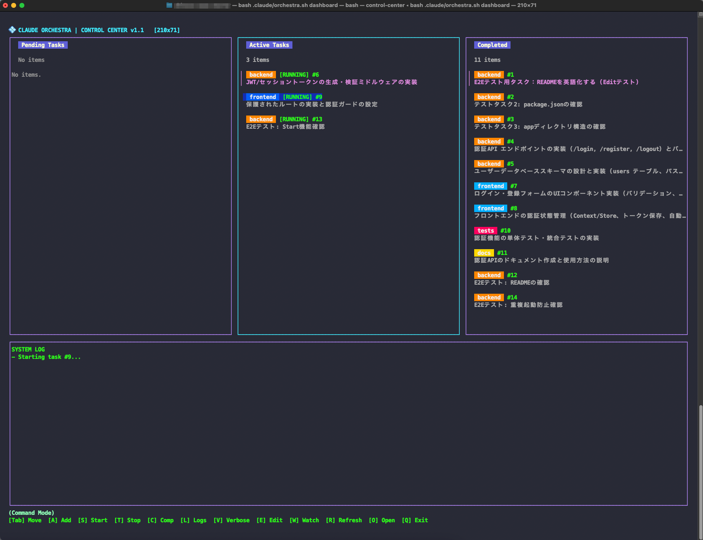
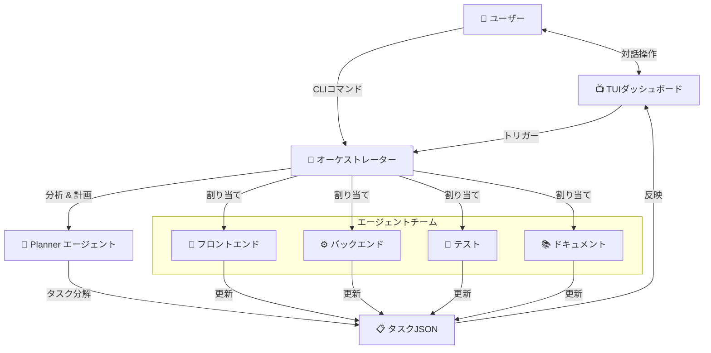
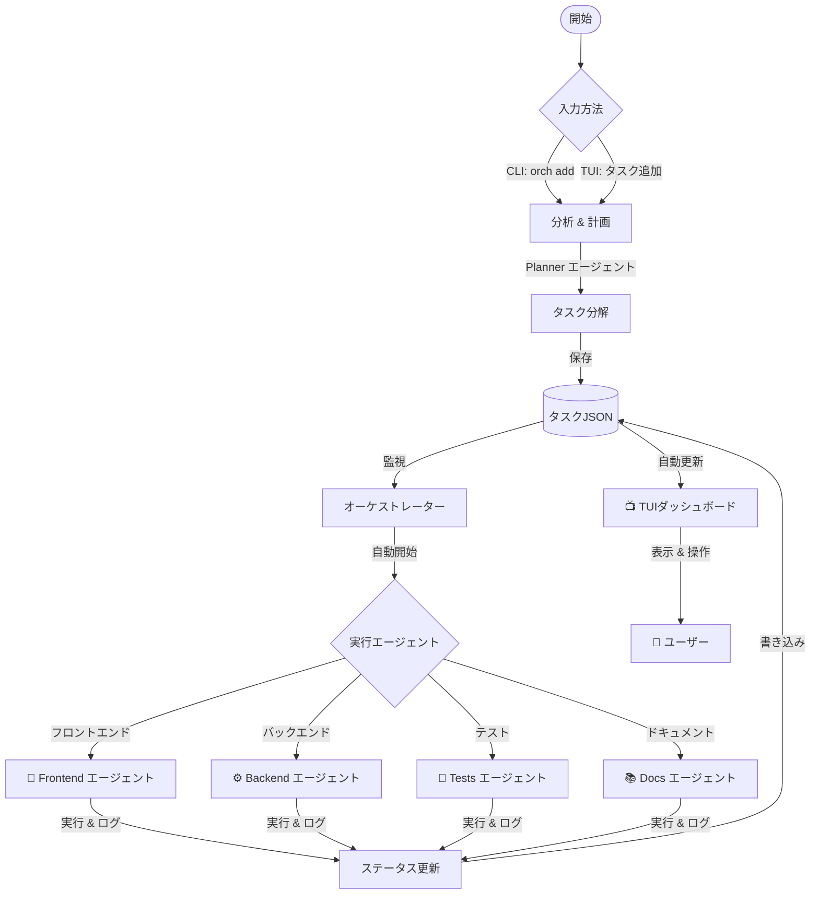

# Claude Orchestra 🎺

<div align="center">


**Claude Code を活用した自律型マルチエージェント開発基盤**

[特徴](#-特徴) • [インストール](#-インストール) • [使い方](#-使い方) • [アーキテクチャ](#-アーキテクチャ)

</div>

---

## 🚀 Quick Start

**たった1行で、あなたのプロジェクトにAI開発チームを召喚します。**

```bash
curl -fsSL https://raw.githubusercontent.com/shineos/claude-orchestra/main/install-remote.sh | bash
```

<br>



## 📖 概要

**Claude Orchestra** は、Anthropic の公式 CLI ツール `Claude Code` を拡張し、複数の専門エージェントが協調して開発を行うためのオーケストレーションシステムです。

単なるチャットボットではありません。**要件定義から実装、テスト、ドキュメント作成まで**、AIエージェントたちが自律的にタスクを分担・実行し、あなたの開発を強力にサポートします。

### なぜ Claude Orchestra なのか？

- **⚡️ 並列開発**: Frontend, Backend, Tests, Docs エージェントが同時に動き、開発時間を短縮します。
- **🧠 インテリジェントなタスク分解**: 複雑な要件をAIが分析し、最適なサブタスクに自動分解します。
- **🖥 美しいTUI**: ターミナルで完結する、直感的で美しいダッシュボードを提供します。

## ✨ 特徴

- **🤖 自律型エージェントチーム**
    - **Planner**: 全体の計画立案とタスク管理
    - **Frontend**: UI/UXの実装 (React, Vue, Tailwind...)
    - **Backend**: API, DB設計, サーバーサイドロジック
    - **Tests**: 単体テスト, 結合テストの作成と実行
    - **Docs**: README, 仕様書の自動更新

- **📊 TUI ダッシュボード**
    - リアルタイムな進捗可視化
    - カンバンボード形式のタスク管理
    - キーボード操作に最適化 (Vimライクなバインディング)

- **🔄 シームレスなワークフロー**
    - `orch add "機能追加"` だけで、AIがプランを作成・提案
    - 承認するだけでエージェントが一斉に稼働開始
    - ログはリアルタイムでストリーミング確認可能

## 📦 インストール

### 推奨環境
- macOS または Linux
- `bash` (4.0以上推奨)
- `jq`
- `claude` (Claude Code CLI)

### ワンライナー (推奨)

```bash
# カレントディレクトリのプロジェクトにインストール
curl -fsSL https://raw.githubusercontent.com/shineos/claude-orchestra/main/install-remote.sh | bash
```

### オプション

```bash
# インストール先を指定
curl -fsSL https://raw.githubusercontent.com/shineos/claude-orchestra/main/install-remote.sh | bash -s -- /path/to/project

# 特定バージョンを指定
curl -fsSL https://raw.githubusercontent.com/shineos/claude-orchestra/main/install-remote.sh | bash -s -- -v v1.0.0
```

### 3. 便利に使うための設定 (推奨)

プロジェクトのルートディレクトリで `orch` コマンドを使えるようにエイリアスを設定します。

```bash
# .zshrc または .bashrc に追加
alias orch='bash .claude/orchestra.sh'
alias agent='bash .claude/agent.sh' # 個別にエージェントを動かす場合
```


## 🏗 アーキテクチャ



### 🔄 フローチャート



## 🎮 使い方

### 1. タスクの追加 (AIオートモード)

やりたいことを自然言語で伝えるだけです。

```bash
orch add "ユーザーログイン機能を実装して"
```

AIがタスクを分析し、提案を作成します。`Y` で承認すると、各エージェントが作業を開始します。

### 2. 進捗の確認

ダッシュボードで全エージェントの動きを把握できます。

```bash
orch dashboard --watch
```

### 3. エージェントのログ確認

特定のエージェントが何をしているか詳しく見たい場合：

```bash
# 全エージェントのログを流し見
orch logs -f

# 特定のエージェントのみ
orch logs -f backend
```

## 🛠 コマンドリファレンス

| コマンド | 説明 |
|---|---|
| `orch add "内容"` | AIによるタスク分解と追加 |
| `orch status` | タスク一覧とステータス確認 |
| `orch dashboard` | TUIダッシュボード起動 |
| `orch logs` | エージェントのログ確認 |
| `orch stop all` | 全エージェントの停止 |
| `orch clean` | 完了タスクのアーカイブ（整理） |

詳細なドキュメントは [docs/specification.md](docs/specification.md) をご覧ください。

---

<div align="center">

**Enjoy Orchestration! 🎻**

[Report Bug](https://github.com/shineos/claude-orchestra/issues) • [Request Feature](https://github.com/shineos/claude-orchestra/issues)

</div>
