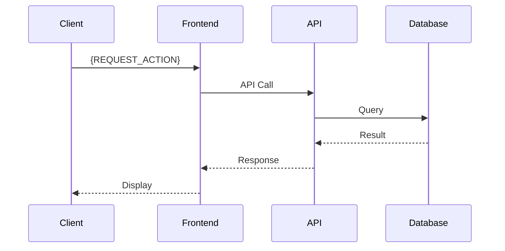

# アーキテクチャ図: {SYSTEM_NAME}

## 概要
{SYSTEM_DESCRIPTION}

## システム全体図

```mermaid
graph TB
    subgraph "Frontend Layer"
        FE1[{Frontend App}]
        FE2[{Admin Dashboard}]
    end

    subgraph "API Layer"
        API1[API Gateway]
        API2[Auth Service]
        API3[Business Service]
    end

    subgraph "Data Layer"
        DB1[(Database)]
        DB2[(Cache)]
        STG[Storage]
    end

    subgraph "External Services"
        EXT1[External API]
        EXT2[Payment Gateway]
    end

    FE1 --> API1
    FE2 --> API1
    API1 --> API2
    API1 --> API3
    API2 --> DB1
    API3 --> DB1
    API2 --> DB2
    API3 --> STG
    API3 --> EXT1
    API3 --> EXT2
```

## コンポーネント説明

### Frontend Layer
| コンポーネント | 技術スタック | 説明 |
|---------------|-------------|------|
| {FE_COMPONENT_1} | {FE_TECH_1} | {FE_DESC_1} |
| {FE_COMPONENT_2} | {FE_TECH_2} | {FE_DESC_2} |

### API Layer
| コンポーネント | 技術スタック | 説明 |
|---------------|-------------|------|
| {API_COMPONENT_1} | {API_TECH_1} | {API_DESC_1} |
| {API_COMPONENT_2} | {API_TECH_2} | {API_DESC_2} |

### Data Layer
| コンポーネント | 技術スタック | 説明 |
|---------------|-------------|------|
| {DATA_COMPONENT_1} | {DATA_TECH_1} | {DATA_DESC_1} |
| {DATA_COMPONENT_2} | {DATA_TECH_2} | {DATA_DESC_2} |

## データフロー



## 技術スタック一覧

### フロントエンド
- **フレームワーク**: {FE_FRAMEWORK}
- **UIライブラリ**: {FE_UI_LIBRARY}
- **状態管理**: {FE_STATE_MANAGEMENT}
- **ビルドツール**: {FE_BUILD_TOOL}

### バックエンド
- **言語**: {BE_LANGUAGE}
- **フレームワーク**: {BE_FRAMEWORK}
- **APIスタイル**: {API_STYLE}
- **認証**: {AUTH_METHOD}

### データベース
- **RDBMS**: {DB_RDBMS}
- **キャッシュ**: {DB_CACHE}
- **ORM**: {DB_ORM}

### インフラ
- **ホスティング**: {INFRA_HOSTING}
- **CI/CD**: {INFRA_CICD}
- **コンテナ**: {INFRA_CONTAINER}
- **オーケストレーション**: {INFRA_ORCHESTRATION}

## 非機能要件

### パフォーマンス
- {PERFORMANCE_REQ_1}
- {PERFORMANCE_REQ_2}

### セキュリティ
- {SECURITY_REQ_1}
- {SECURITY_REQ_2}

### 可用性
- {AVAILABILITY_REQ_1}
- {AVAILABILITY_REQ_2}

## 関連ドキュメント
- [コンポーネント図]({COMPONENT_DIAGRAM_PATH})
- [配置図]({DEPLOYMENT_DIAGRAM_PATH})
- [API仕様書]({API_SPEC_PATH})

---
*作成日: {CREATION_DATE}*
*作成者: {AUTHOR}*
