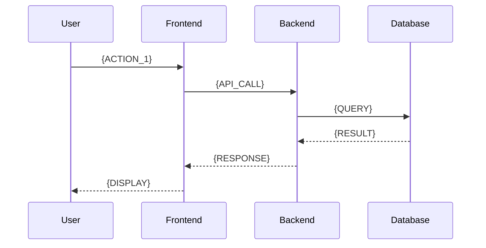

# 機能設計書: {FEATURE_NAME}

## 概要
{FEATURE_DESCRIPTION}

## 背景・目的
### 背景
{BACKGROUND}

### 目的
{PURPOSE}

## 要件
### 機能要件
- [ ] {FUNCTIONAL_REQUIREMENT_1}
- [ ] {FUNCTIONAL_REQUIREMENT_2}

### 非機能要件
- [ ] {NON_FUNCTIONAL_REQUIREMENT_1}
- [ ] {NON_FUNCTIONAL_REQUIREMENT_2}

## ユーザーストーリー
**As a** {USER_ROLE}
**I want** {GOAL}
**So that** {BENEFIT}

## 画面設計
### 画面遷移図
```mermaid
graph LR
    A[{SCREEN_1}] --> B[{SCREEN_2}]
    B --> C[{SCREEN_3}]
```

### ワイヤーフレーム
{WIREFRAME_IMAGE_OR_DESCRIPTION}

## API設計
### エンドポイント一覧
| メソッド | パス | 説明 |
|---------|------|------|
| {METHOD} | {PATH} | {DESCRIPTION} |

詳細: [API仕様書]({API_SPEC_PATH})

## データベース設計
### 関連テーブル
- `{TABLE_1}`: {DESCRIPTION_1}
- `{TABLE_2}`: {DESCRIPTION_2}

詳細: [テーブル設計書]({TABLE_DESIGN_PATH})

## シーケンス図


## テスト計画
### テストケース
| ID | テスト内容 | 期待結果 |
|----|-----------|---------|
| {TEST_ID} | {TEST_CASE} | {EXPECTED_RESULT} |

詳細: [テスト計画書]({TEST_PLAN_PATH})

## 実装計画
### タスク分解
- [ ] {TASK_1}
- [ ] {TASK_2}
- [ ] {TASK_3}

### スケジュール
| フェーズ | 期間 | 担当 |
|---------|------|------|
| {PHASE_1} | {DURATION_1} | {AGENT_1} |
| {PHASE_2} | {DURATION_2} | {AGENT_2} |

## リスク・課題
| リスク | 影響度 | 対策 |
|--------|--------|------|
| {RISK_1} | {IMPACT_1} | {MITIGATION_1} |

## 関連ドキュメント
- [アーキテクチャ図]({ARCHITECTURE_PATH})
- [API仕様書]({API_SPEC_PATH})
- [テーブル設計書]({TABLE_DESIGN_PATH})

---
*作成日: {CREATION_DATE}*
*作成者: {AUTHOR}*
