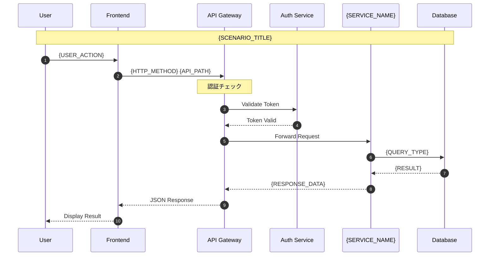
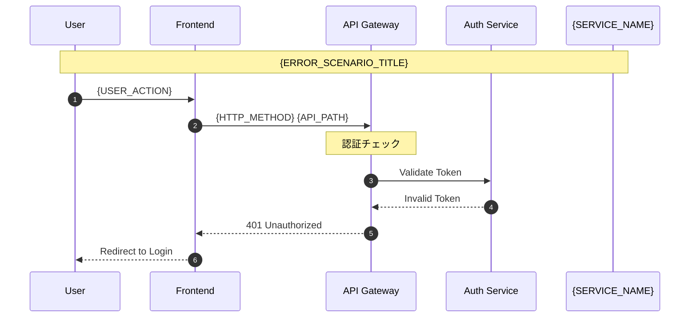
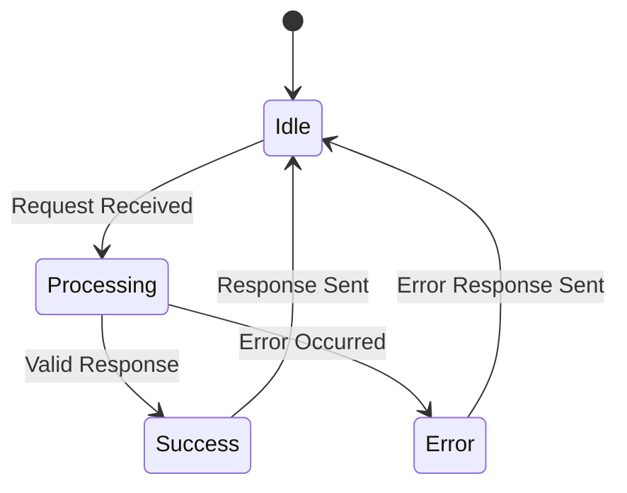

# APIフローシーケンス: {API_NAME}

## 概要
{API_DESCRIPTION}

## シーケンス図



## エラーシナリオ



## API エンドポイント

### {ENDPOINT_NAME}

| 項目 | 値 |
|------|-----|
| メソッド | {HTTP_METHOD} |
| パス | {API_PATH} |
| 認証 | {AUTH_REQUIRED} |
| レート制限 | {RATE_LIMIT} |

### リクエスト

**ヘッダー:**
```http
{HEADER_NAME}: {HEADER_VALUE}
Content-Type: application/json
Authorization: Bearer {TOKEN}
```

**ボディ:**
```json
{
  "{PARAM_1}": "{VALUE_1}",
  "{PARAM_2}": "{VALUE_2}"
}
```

### レスポンス

**成功 (200 OK):**
```json
{
  "success": true,
  "data": {
    "{RESPONSE_FIELD_1}": "{RESPONSE_VALUE_1}",
    "{RESPONSE_FIELD_2}": "{RESPONSE_VALUE_2}"
  }
}
```

**エラー (4xx/5xx):**
```json
{
  "success": false,
  "error": {
    "code": "{ERROR_CODE}",
    "message": "{ERROR_MESSAGE}",
    "details": "{ERROR_DETAILS}"
  }
}
```

## 状態遷移図



## タイミング要件

| フェーズ | 目標時間 | 最大許容時間 |
|---------|---------|--------------|
| {PHASE_1} | {TARGET_TIME_1} | {MAX_TIME_1} |
| {PHASE_2} | {TARGET_TIME_2} | {MAX_TIME_2} |

## 関連ドキュメント
- [API仕様書]({API_SPEC_PATH})
- [機能設計書]({FEATURE_SPEC_PATH})
- [テーブル設計書]({TABLE_DESIGN_PATH})

---
*作成日: {CREATION_DATE}*
*作成者: {AUTHOR}*
