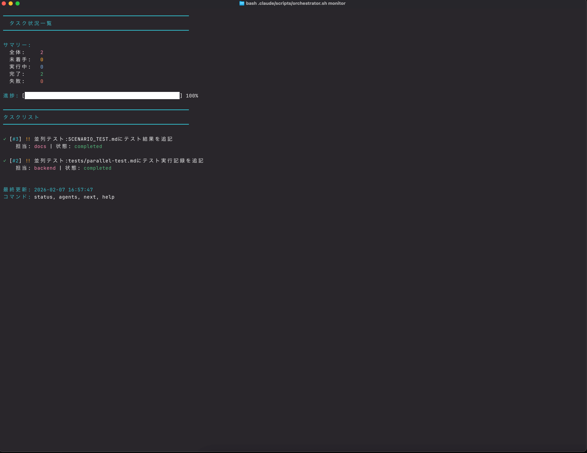
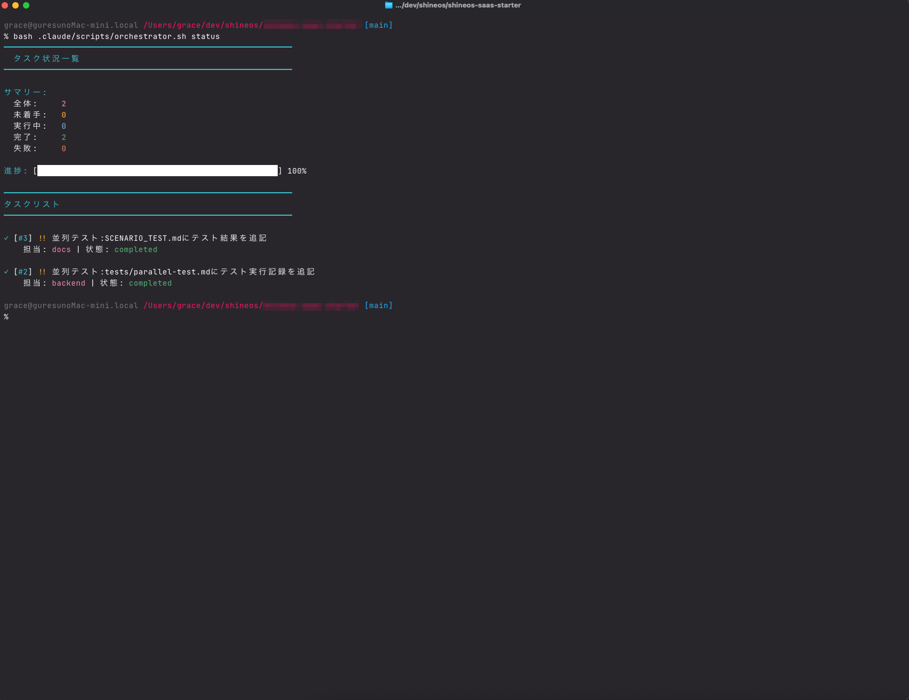

# 仕様書 (Specification)

Claude Code マルチエージェントシステムの詳細仕様について記述します。

## アーキテクチャ概要

本システムは、**Orchestrator（調整役）** と複数の **専門エージェント** から構成される自律型マルチエージェントシステムです。Claude Code CLI を活用し、自然言語による指示を具体的な技術タスクに分解・実行します。


*システム全体像*

### 構成要素

1.  **Orchestrator Agent**
    *   **役割**: タスク管理、エージェントへの作業割り当て、進捗監視。
    *   **機能**: 
        *   ユーザーからの自然言語タスクの受け付け
        *   AIによるタスク分解（Decomposition）
        *   依存関係の管理
        *   各エージェントのステータス監視

2.  **Specialized Agents (専門エージェント)**
    *   **Frontend Agent**: UI/UX実装、コンポーネント作成、スタイリング担当。ユーザーインターフェースに関連するタスクを実行します。
    *   **Backend Agent**: API実装、データベース設計、認証ロジック担当。サーバーサイドのロジックやデータ管理を行います。
    *   **Tests Agent**: テストコード作成、テスト実行、品質保証担当。単体テストからE2Eテストまでを担当します。
    *   **Docs Agent**: ドキュメント作成、仕様書更新担当。READMEやAPI仕様書の整備を行います。

## タスクフロー

1.  **タスク登録**: ユーザーが `orch add "機能名"` でタスクを登録します。
2.  **AI分析**: OrchestratorがClaude AIを使用してタスクを分析し、必要なサブタスクに分解します。
3.  **確認・承認**: 分解されたプランをユーザーが確認し、承認（または修正）します。
4.  **自動実行**: 各エージェントが自分に割り当てられたタスクを検知し、自律的に実行します。
    *   ファイル作成・編集
    *   コマンド実行
    *   検証
5.  **完了報告**: タスク完了後、Orchestratorにステータスを報告します。

## モニタリング

システムの状態はリアルタイムで監視可能です。


*リアルタイムモニタリング画面*


*タスクステータス一覧*

## ディレクトリ構造

```
.claude/
├── config.json          # プロジェクト全体の設定
├── tasks.json           # タスクデータベース（JSON形式）
├── agents/              # 各エージェントのプロンプト・設定定義
│   ├── orchestrator.json
│   ├── frontend.json
│   ├── backend.json
│   ├── tests.json
│   └── docs.json
├── scripts/             # 実行スクリプト群
│   └── orchestrator.sh  # メイン制御スクリプト
└── logs/                # 実行ログ
```

## 技術スタック

*   **Core**: Bash Scripting
*   **AI Engine**: Claude Code CLI (Anthropic)
*   **Data Handling**: jq (JSON Processor)
*   **Concurrency**: Background processes / tmux (optional)
